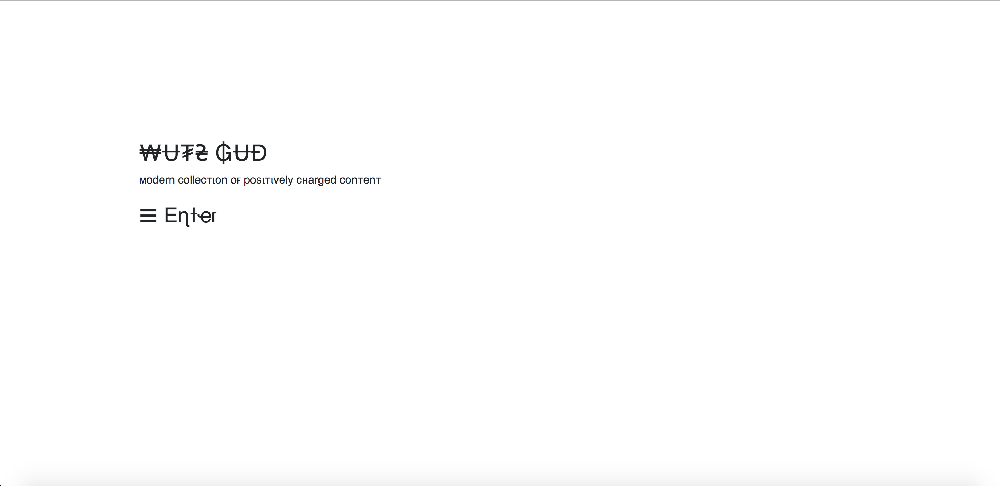
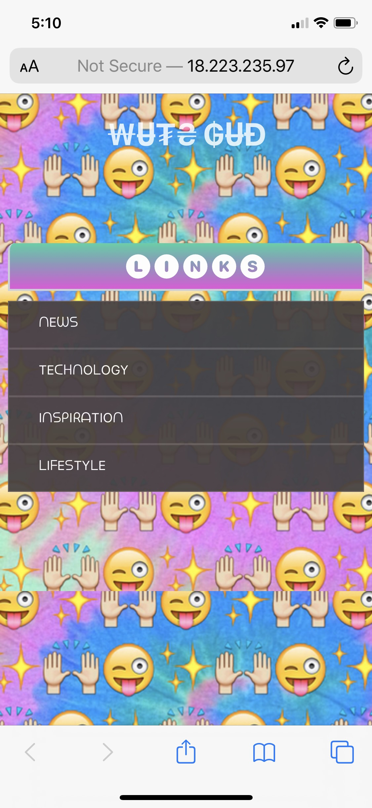
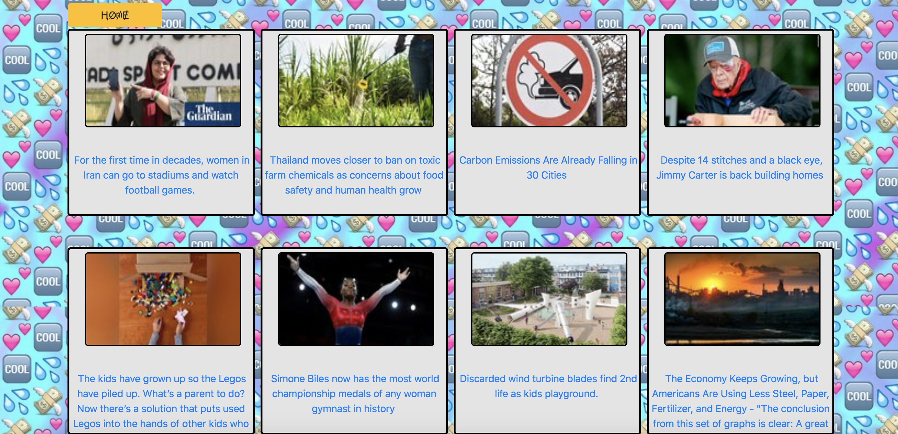

# Wuts-Gud
Wuts-Gud is a mobile friendly web app that features various links to news articles via the Reddit API. The thing that makes Wuts-Gud different from most news feeds is that all of the articles available through Wats-Gud are filtered to only provide positive and uplifiting stories. This is done by curating some of my favorite sub-reddits like "AmazingTechnology", "UpliftingNews", and "GetMotivated".
## Purpose
I like to stay informed with what's going on in the world but I get tired of seeing only the depressing stories being featured 99% of the time. So I decided to create a newsfeed for people like me that know there is more going on than just death and destruction.
## Technologies
- **Python** back-end
- **Django** server framework
- **PRAW** python reddit api wrapper package
- **HTML5** templates
- **CSS3** styling
## Screenshots
Landing

Landing(mobile)

Newsfeed

Newsfeed(mobile)
